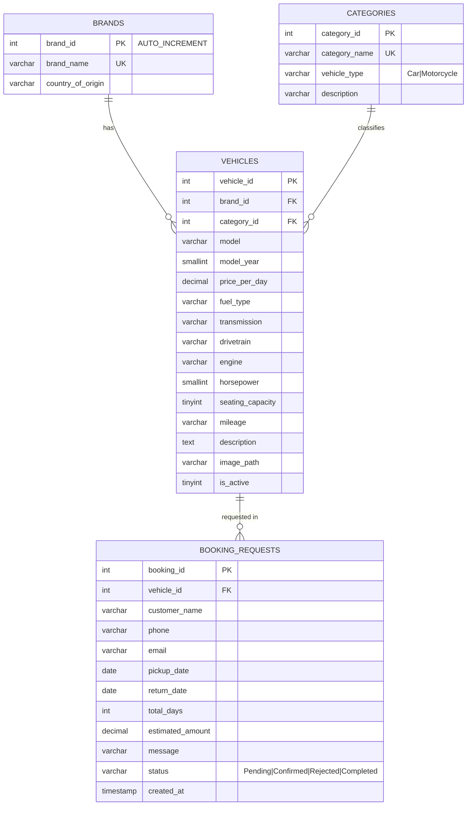

# ER Diagram (render with any Mermaid viewer, e.g. mermaid.live, or GitHub preview)

```mermaid
erDiagram
  BRANDS ||--o{ VEHICLES : "has"
  CATEGORIES ||--o{ VEHICLES : "classifies"
  VEHICLES ||--o{ BOOKING_REQUESTS : "requested in"
  BRANDS { int brand_id PK "AUTO_INCREMENT"
           varchar brand_name UK
           varchar country_of_origin }
  CATEGORIES { int category_id PK
               varchar category_name UK
               varchar vehicle_type "Car|Motorcycle"
               varchar description }
  VEHICLES { int vehicle_id PK
             int brand_id FK
             int category_id FK
             varchar model
             smallint model_year
             decimal price_per_day
             varchar fuel_type
             varchar transmission
             varchar drivetrain
             varchar engine
             smallint horsepower
             tinyint seating_capacity
             varchar mileage
             text description
             varchar image_path
             tinyint is_active }
  BOOKING_REQUESTS { int booking_id PK
                     int vehicle_id FK
                     varchar customer_name
                     varchar phone
                     varchar email
                     date pickup_date
                     date return_date
                     int total_days
                     decimal estimated_amount
                     varchar message
                     varchar status "Pending|Confirmed|Rejected|Completed"
                     timestamp created_at }
```
For the PDF report, export this to PNG (`docs/er-diagram.png`) from mermaid.live.
